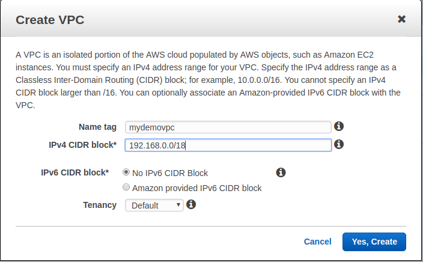
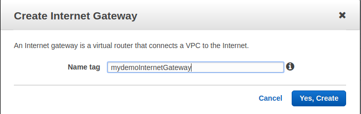
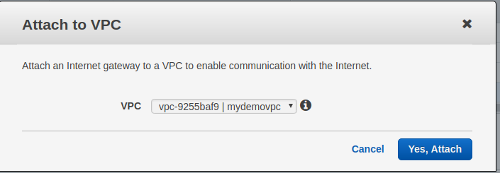
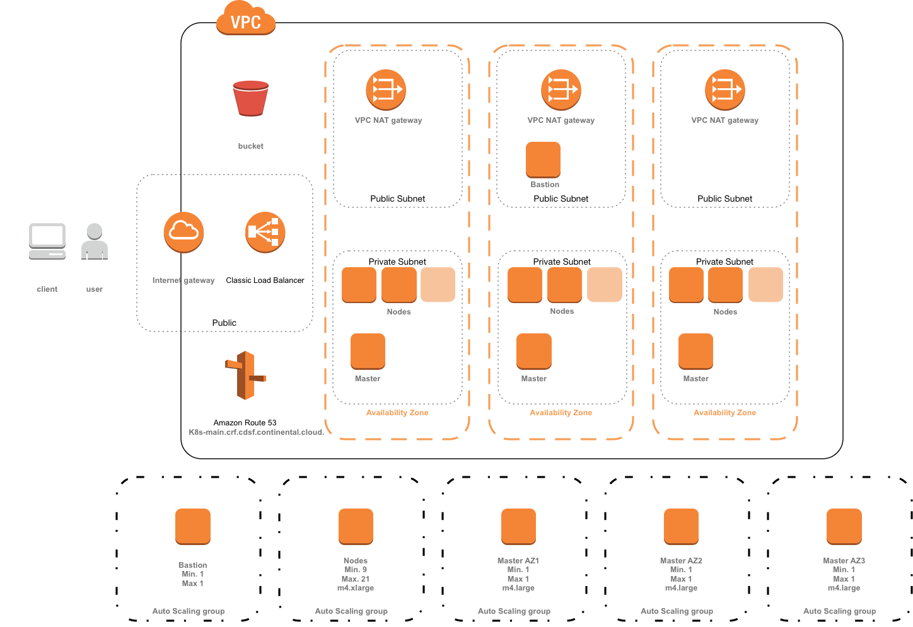

# Exercise 1 - Startup a Kubernetes Cluster

## Pre requisite

### Install Kops

[Github Kops install](https://github.com/kubernetes/kops/blob/master/docs/install.md)

#### MacOS

From Homebrew:

```sh
brew update && brew install kops
```

From Github:

```sh
wget -O kops https://github.com/kubernetes/kops/releases/download/$(curl -s https://api.github.com/repos/kubernetes/kops/releases/latest | grep tag_name | cut -d '"' -f 4)/kops-darwin-amd64
chmod +x ./kops
sudo mv ./kops /usr/local/bin/
```

You can also [install from source](development/building.md).

#### Linux

From Github:

```sh
wget -O kops https://github.com/kubernetes/kops/releases/download/$(curl -s https://api.github.com/repos/kubernetes/kops/releases/latest | grep tag_name | cut -d '"' -f 4)/kops-linux-amd64
chmod +x ./kops
sudo mv ./kops /usr/local/bin/
```

### AWS User 

Have created a user with sufficient privileges:

```
AmazonEC2FullAccess
AmazonRoute53FullAccess
AmazonS3FullAccess
IAMFullAccess
AmazonVPCFullAccess
```
You can create kops user with console or with folowing aws cli command line:

```sh
aws iam create-group --group-name kops

aws iam attach-group-policy --policy-arn arn:aws:iam::aws:policy/AmazonEC2FullAccess --group-name kops
aws iam attach-group-policy --policy-arn arn:aws:iam::aws:policy/AmazonRoute53FullAccess --group-name kops
aws iam attach-group-policy --policy-arn arn:aws:iam::aws:policy/AmazonS3FullAccess --group-name kops
aws iam attach-group-policy --policy-arn arn:aws:iam::aws:policy/IAMFullAccess --group-name kops
aws iam attach-group-policy --policy-arn arn:aws:iam::aws:policy/AmazonVPCFullAccess --group-name kops

aws iam create-user --user-name kops

aws iam add-user-to-group --user-name kops --group-name kops

aws iam create-access-key --user-name kops
```

Retrieve **AWS KEY**

### Domain registration on AWS Route 53

You can create a subdomain or attach to an existing domain

Check your domain

```sh
dig ns mydemodomain.domain.cloud
```

```
;; ANSWER SECTION:
mydemodomain.domain.cloud. 866 IN	SOA ns-138.awsdns-17.com. awsdns-hostmaster.amazon.com. 1 7200 900 1209600 86400
```

You need to retrieve **Hosted Zone ID** from console or command line

### S3 Bucket for State Store

You need to create an S3 Bucket to keep the state of your k8s cluster and be able to perform admin tasks 

```sh
aws s3api create-bucket \
    --bucket mydemobucket-cloud-state-store \
    --region eu-central-1
```

Retrieve **S3 address**

### Create your dedicated VPC (Optional)



Retrieve **VPC Id**

### Create you AWS Internet Gateway (Optional)

If you have previously created a dedicated VPC you need to create an AWS Internet Gateway:



And attach it to your VPC:



## Create your Cluster

### Launch Creation

Export AWS credential and s3 bucket

```sh
export AWS_ACCESS_KEY_ID=XXXXXX
export AWS_SECRET_ACCESS_KEY=XXXXX
export KOPS_STATE_STORE=s3://mydemobucket-cloud-state-store
```

We are now ready to launch our k8 cluster creation. In this exercise we will create a public cluster split in three AZ has bellow:



```sh
kops create cluster  \
  --node-count 3 \
  --zones eu-central-1a,eu-central-1b,eu-central-1c \
  --master-zones eu-central-1a,eu-central-1b,eu-central-1c  \
  --dns-zone=YOURHOSTEDZONEID \
  --node-size t2.micro \
  --master-size t2.micro  \
  --topology private \
  --networking calico \
  --vpc=YOURVPCID \
  --bastion  \
  --kubernetes-version=1.7.6 \
  --name=k8s-main.mydemodomain.domain.cloud \
  --cloud-labels "Name=Test Cluster,Env=Demo" \
  --ssh-public-key ~/.ssh/mykey.pub
  ```

Launch installation:

```sh
kops update cluster k8s-main.mydemodomain.domain.cloud --yes
```

Check installation:

Validate Cluster Creation on AWS:

```sh
kops validate cluster
```

Validation K8S cluster:

```sh
kubectl get nodes
```

### Install Addons

Install addon if needed:

* Add Heapster
* Add Dashboard
* External DNS
* Node Problem Detector

### Post Installation

If you want to use **admission control** you need to edit existing cluster and add following line:

```sh
kops edit cluster k8s-main.mydemodomain.domain.cloud
```

```
kubeAPIServer:
    admissionControl:
    - NamespaceLifecycle
    - LimitRanger
    - ServiceAccount
    - PersistentVolumeLabel
    - DefaultStorageClass
    - ResourceQuota
    - DefaultTolerationSeconds
    - Initializers
    runtimeConfig:
      admissionregistration.k8s.io/v1alpha1: "true"
```

Perfom update:

```sh
kops update cluster --yes
kops rolling-update cluster --yes
```

Check result with:
```
kubectl api-versions | grep admi
;;; 
admissionregistration.k8s.io/v1alpha1
```
