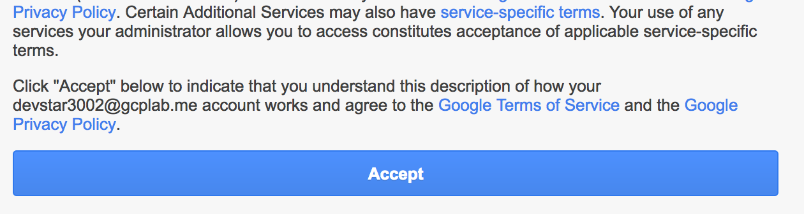
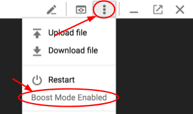

## Workshop Setup

###  Google Cloud Console Setup

1 - The instructor will provide you with a temporary username / password to sign in to the Google Cloud Platform Console.

**Important:** To avoid conflicts with your personal account, please open a new incognito window for the rest of this lab.

Sign in to the Google Cloud Platform Console: [https://console.cloud.google.com/home](https://console.cloud.google.com/home) with the provided credentials. In Welcome to your new account dialog, click Accept.

2 - Check I agree and click Agree and Continue

2 - If you see a top bar with Sign Up for Free Trial - DO NOT SIGN UP FOR THE FREE TRIAL. Click Dismiss since you'll be using a pre-provisioned lab account. If you are doing this on your own account, then you may want the free trial.

2 - Select the only Google Cloud Platform project in the project list. If you don't see a project, let the instructor know!

##  Google Cloud Shell

You will do most of the work from the [Google Cloud Shell](https://cloud.google.com/developer-shell/#how_do_i_get_started), a command line environment running in the Cloud. This Debian-based virtual machine is loaded with all the development tools you’ll need (docker, gcloud, kubectl and others) and offers a persistent 5GB home directory. Open the Google Cloud Shell by clicking on the icon on the top right of the screen:

1. When prompted, click Start Cloud Shell. You should see the shell prompt at the bottom of the window.

2. Check to see if Cloud Shell's Boost mode is Enabled.

3. If not, then enable Boost Mode for Cloud Shell.

** Note: When you run gcloud on your own machine, the config settings will be persisted across sessions.  But in Cloud Shell, you will need to set this for every new session / reconnection. **

## Get the Workshop Source:

Clone from the current repository, e.g.

  `git clone https://github.com/retroryan/istio-workshop`

## Optional - Local Setup

You can setup the Google Cloud SDK locally but that is out of the scope of this workshop.  See the [Cloud SDK for more information](https://cloud.google.com/sdk/)

#### [Continue to Exercise 1](../exercise-1/README.md)
