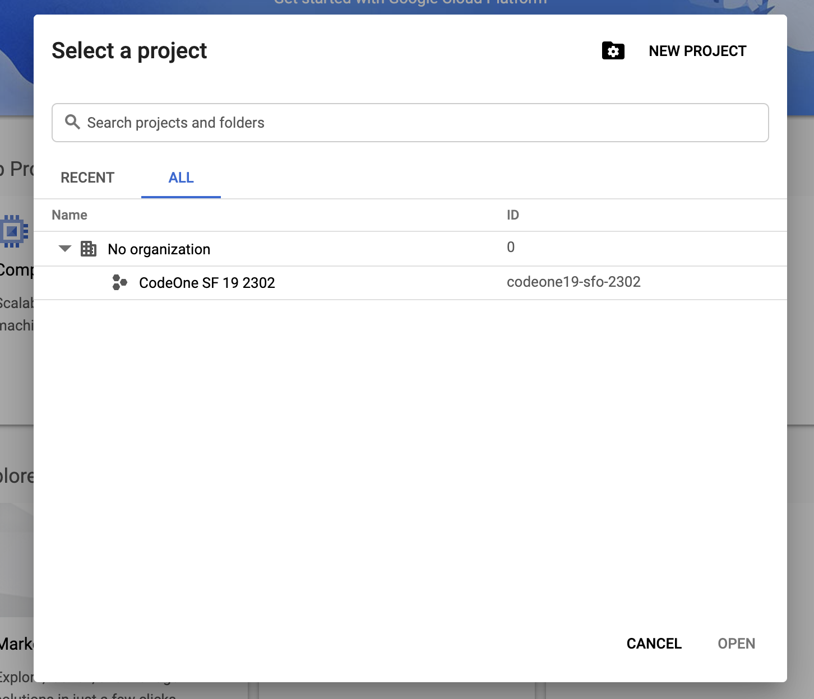

## Workshop Setup

###  Google Cloud Console Setup

Login to Google Cloud Console with the special workshop credentials:

[https://console.cloud.google.com/home](https://console.cloud.google.com/home)

If you were provided with a Google Cloud Lab username setup the account by:

1 - Dismiss the offer for a free trial and select the project

2 - Select the only Google Cloud Platform project in the project list. If you don't see a project, let the instructor know!

##  Google Cloud Shell or Local Install

This workshop can either be run all locally using the following setup instructions or it can be run in Google Cloud Shell.

### Local Setup [CLOUD SDK](https://cloud.google.com/sdk/)

####  Install Cloud SDK

  `./google-cloud-sdk/install.sh`

#### Initialize Cloud SDK

  `./google-cloud-sdk/bin/gcloud init`

#### Login to Cloud

  `gcloud auth login`

#### Verify Cloud SDK

  `gcloud config list`

#### Install kubectl

  `gcloud components install kubectl`

If you already have an installation of kubectl in your computer you can skip this step.

## Get the Workshop Source:
  
Clone from the current repository, e.g.

  `git clone https://github.com/THIS_REPOSITORY/istio-workshop`

#### Windows Setup

If you install [Git for Windows](https://git-scm.com/downloads) you get Curl automatically too. There are some advantages:

Git takes care of the PATH setup during installation automatically.
You get the GNU bash, a really powerful shell, in my opinion much better than the native Windows console.
You get many other useful Linux tools like tail, cat, grep, gzip, pdftotext, less, sort, tar, vim and even Perl.

#### [Continue to Exercise 1](../exercise-1/README.md)
